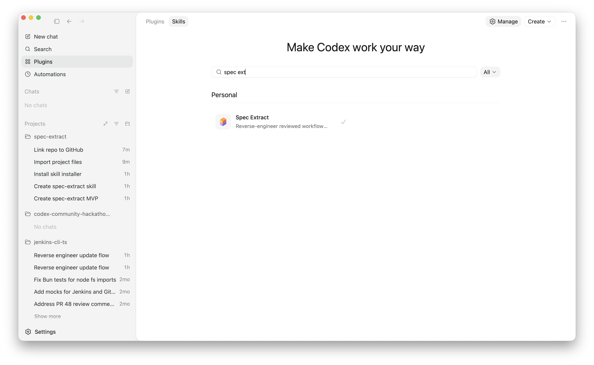
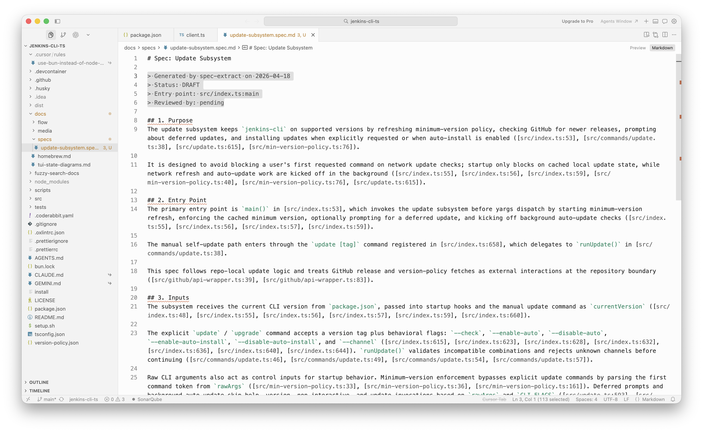
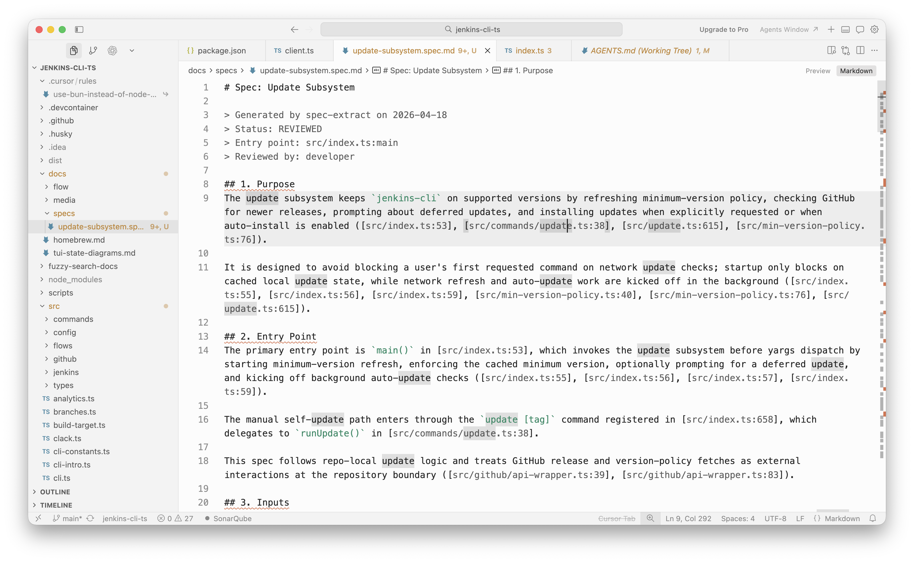
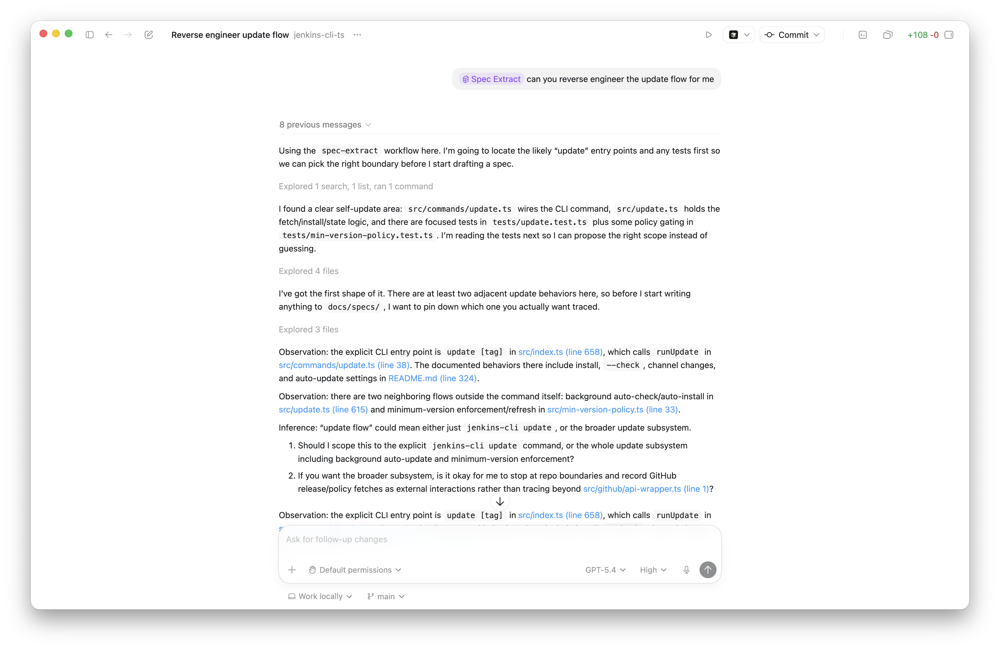

# spec-extract

<p align="center">
  <strong>Code is evidence, not truth. Only the developer knows which parts are intentional.</strong>
</p>

<p align="center">
  A Codex skill that collaboratively reverse-engineers production workflows into reviewed, classified specifications — one conversation at a time.
</p>

<p align="center">
  
</p>

## The Problem

Every company with more than a couple years of code has production workflows nobody fully understands. Sometimes the person who wrote it left. But more often, the person who built it is still there — they maintain it, they carry the context in their head, and they never have time to write it down. They're too busy keeping the system running to produce the specs that would let anyone else (or any AI tool) work on it safely.

Either way, the result is the same: there are no specs, no ADRs, no documented decisions. The "specification" is whatever the code happens to do today — including its bugs, its accidental behaviors, and its undocumented assumptions. The maintainer's knowledge stays trapped in their head, tying them to old systems instead of freeing them to work on what matters next.

When AI coding tools work on this code, they reverse-engineer intent from implementation. They treat code as truth. But code is not truth — it's evidence.

A hardcoded timeout of 30 seconds might be an intentional SLA requirement or an arbitrary guess someone made at 2am. A retry loop with no backoff might be a deliberate choice for latency-sensitive paths or a bug nobody noticed. The code can't tell you which. Only the developer who owns that system can.

This means every AI-assisted refactor, feature addition, or bug fix on undocumented legacy code operates on assumptions. And wrong assumptions compound silently:

- The AI preserves bugs it thinks are features.
- It removes "dead code" that external consumers still depend on.
- It refactors away behavior that exists for regulatory reasons nobody wrote down.
- It normalizes a workaround into the canonical path because it can't tell the difference.

The root cause: there is no authoritative specification that distinguishes intentional behavior from accidental behavior, required behavior from deprecated behavior, business rules from historical workarounds.

## Why Not Just Ask AI to Document the Code?

Because auto-generated documentation is a mirror of the code, not a source of truth. If you ask an AI to "document this workflow," it will describe what the code does — faithfully reproducing every bug, workaround, and accident as if it were intentional. You end up with confident-sounding documentation that encodes the same ambiguity you started with.

`spec-extract` takes a fundamentally different approach: **the agent proposes, but the developer decides.** The agent reads code and presents observations with citations. The developer confirms, corrects, or adds context. Nothing enters the spec without human sign-off. Every non-trivial behavior gets explicitly classified by the developer. When the developer explains *why* something exists, that rationale is captured as an Architectural Decision Record.

This is not "generate and review." It is conversational spec building — and the distinction matters. "Generate and review" puts the burden on the developer to catch what the AI got wrong. Conversational building puts the burden on the agent to *ask* before assuming.

## How It Works

1. **Scope.** The developer identifies a workflow and an entry point (`file:function`, route, job, event handler, or plain-language description) and sets boundaries on how deep to trace.

2. **Read.** The agent searches for tests first, reads them before implementation, and follows the call graph. It collects evidence about entry points, inputs, branching logic, external interactions, side effects, error handling, and implicit assumptions.

3. **Propose.** For each spec section, the agent presents observations with `file:line` citations, explicitly marks any inferences, and asks at most 3 targeted questions per turn.

4. **Confirm.** The developer confirms, corrects, or rewrites. Only confirmed content enters the spec. Unresolved items go into Open Questions — never into the spec body.

5. **Classify.** Each non-trivial confirmed behavior gets a developer-assigned tag (see below). This is what turns documentation into a migration map.

6. **Capture rationale.** When the developer explains *why* something exists — not just what it does — the agent offers to record that as an ADR. No invented alternatives. No speculative reasoning. Just the developer's actual explanation.

7. **Write incrementally.** The spec file grows on disk section by section. The developer can open and read it at any point during the conversation. The file is always coherent and never contains placeholder text.

## Every Behavior Gets a Verdict

Every confirmed behavior is tagged by the developer, not by the agent. Six tags cover the full spectrum from "must preserve" to "nobody knows":

| Tag | Meaning | Example |
| --- | --- | --- |
| `REQUIRED` | Intentional, must be preserved. | "Finance policy requires human review for refunds older than 90 days." |
| `ALLOWED_UNDESIRABLE` | Works today, should not be the long-term state. | "We still retry synchronously because the background job migration isn't finished." |
| `DEPRECATED` | Still present, already slated for removal. | "This endpoint only exists for the old mobile client sunset." |
| `BUG_COMPATIBLE` | Known-bad, kept for compatibility or risk. | "The rounding is wrong for one legacy currency, but fixing it breaks reconciliation." |
| `DEAD_PATH` | Unreachable or obsolete, remains by accident. | "This branch was for a payment provider we dropped two years ago." |
| `UNKNOWN` | Neither code nor developer can classify it yet. | "The timeout exists, but I don't know if it's contractual or accidental." |

This classification is what separates a spec from documentation. Documentation tells you what the code does. A classified spec tells you what to preserve, what to fix, and what to remove — which is exactly what an AI coding tool needs before touching production behavior.

## The Flywheel

The first spec is the hardest. After that, each one makes the next easier and every Codex task on that codebase more reliable.

**Spec → Context.** The reviewed spec is linked from `AGENTS.md`. Every future Codex session on that workflow reads authoritative context instead of re-guessing from implementation.

**Classification → Migration backlog.** The behavior tags create an instant inventory: what's required, what's deprecated, what's dead. A tech lead can scan the classification table and prioritize cleanup without re-reading the code.

**ADRs → Decision memory.** When a future developer (or AI) asks "why does this work this way?", the ADR answers it. Decisions stop being re-litigated. Workarounds stop being accidentally canonized.

**Coverage compounds.** Each spec the team produces reduces the surface area of undocumented code. The agent gets better context for adjacent workflows. The second refactor is safer than the first.

Better specs in. Better code out.

## What We Built

The core of `spec-extract` is an interaction protocol, not just a template. The key design decisions:

- **Tests before implementation.** The agent reads test expectations first to build a hypothesis, then reads the code. This mirrors how a good developer onboards onto unfamiliar code.
- **3-question limit per turn.** Forces the agent to prioritize high-value questions instead of overwhelming the developer with a wall of asks.
- **Observation vs. inference separation.** Every agent statement is explicitly marked as "I see this in code" or "I am inferring this." The developer always knows what's grounded and what's guesswork.
- **Incremental disk writes.** The spec file is always readable on disk. No big-bang generation at the end — the developer can open the file mid-conversation and see exactly what's been confirmed so far.
- **Classification as a first-class step.** Not a post-hoc annotation pass. The developer classifies each behavior as it's confirmed, while context is fresh.

Deliverables:

- [`spec-extract/SKILL.md`](./spec-extract/SKILL.md) — the full Codex skill definition
- [`references/spec-template.md`](./spec-extract/references/spec-template.md) — structured spec format with 11 sections
- [`references/behavior-classification.md`](./spec-extract/references/behavior-classification.md) — classification tag guide with examples
- [`references/question-patterns.md`](./spec-extract/references/question-patterns.md) — question templates for each spec section
- [`references/adr-template.md`](./spec-extract/references/adr-template.md) — lightweight ADR format tied to the spec session
- No extra infrastructure. Runs inside Codex CLI, the IDE experience, or the desktop app.

## Screenshots

<p align="center">
  
</p>

<p align="center">
  
</p>

## Demo

<p align="center">
  <a href="./assets/spec-extract-demo.mp4">
    
  </a>
</p>

Click the preview above to watch the end-to-end session, or open [`assets/spec-extract-demo.mp4`](./assets/spec-extract-demo.mp4) directly.

## Quick Start

```text
$spec-extract Document the payment refund workflow starting from src/handlers/refund.ts:handleRefund
```

The skill will walk you through scoping, evidence gathering, confirmation, classification, and ADR capture. At the end you'll have:

- A reviewed spec at `docs/specs/payment-refund.spec.md`
- Any ADRs at `docs/decisions/`
- A suggested `AGENTS.md` snippet so future Codex sessions use the spec as authoritative context

## Repo Layout

```text
spec-extract/
  SKILL.md
  agents/openai.yaml
  references/
    adr-template.md
    behavior-classification.md
    question-patterns.md
    spec-template.md
assets/
  spec-extract-demo.mov
  skill-library.png
  spec-draft.png
  spec-reviewed.png
```
